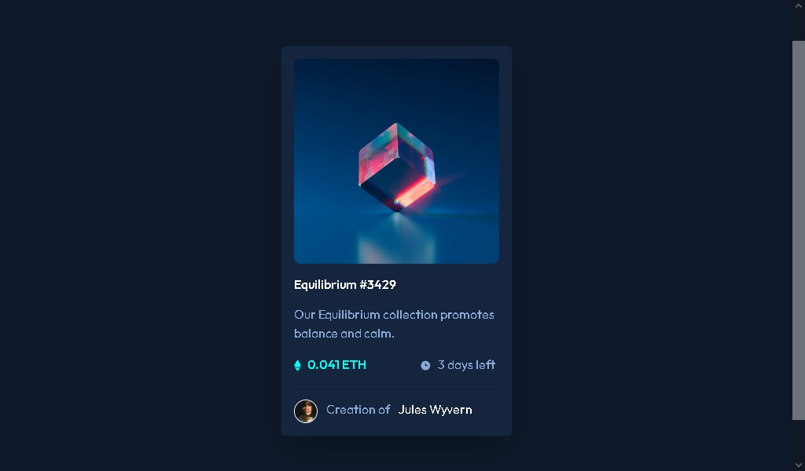

# Desño de tarjeta centrada para una NFT Card, realzada en html y css con Bootstrarp 

# Resumen del diseño.

Este es un diseño de una tarjeta de vista previa, sobre un nft; planteado por el web site frontendmentor.io

Puede ver el reto en esta url:

[Ver Reto Aqui!](https://www.frontendmentor.io/challenges/nft-preview-card-component-SbdUL_w0U/hub/nft-preview-card-component-EXWOkqTuCh)

Para ver la replica del reto realizada por mi persona puede visitar la siguiente url:

[Reto Finalizado Aqui!](https://delightful-squirrel-e154a2.netlify.app/)

# Para este reto utilizamos el siguiente framework

- BootsTraps CSS 5
- Sass Como compilador de codigo CSS

# Codigos de colores y fuentes solicitadas para el reto

### Primary

- Soft blue: hsl(215, 51%, 70%)
- Cyan: hsl(178, 100%, 50%)

### Neutral

- Very dark blue (main BG): hsl(217, 54%, 11%)
- Very dark blue (card BG): hsl(216, 50%, 16%)
- Very dark blue (line): hsl(215, 32%, 27%)
- White: hsl(0, 0%, 100%)

### Font

- Family: [Outfit](https://fonts.google.com/specimen/Outfit)
- Weights: 300, 400, 600